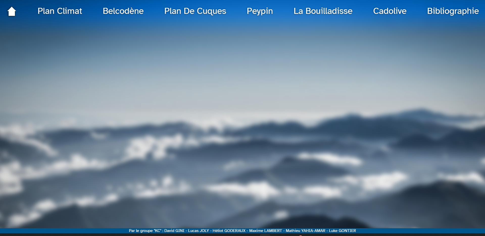

# Développement Site Web : SAE 1.06

L'objectif du projet est de développer un site web incluant les informations dans notre dossier pour la SAE 1.06.

## 1. Langages Utilisés et Restrictions
Il nous était imposé de n'utiliser que du HTML5 (éventuellement du PHP) et du CSS. Le site web devait également rester statique.

## 2. Organisation du travail
Nous avons édité le code de manière collaborative grâce à [un projet replit](https://replit.com/@Dadlab/SAE-106#index.html).

## 3. Démarche et Résultat
Une fois le gros de HTML écrit, nous nous sommes dédiés à la mise en forme du site via un formattage CSS.
Voici le résultat final :  

## 4. A faire
- [x] Maquette du site
- [x] Corps HTML
- [x] Formatage CSS
- [ ] Incorporation Données Dossier
- [ ] Préconisations

## 5. Contenu
**Plan Climat** | **Belcodène** | **Plan de Cuques** | **Peypin** | **La Bouilladisse** | **Cadolive** | **Bibliographie**
----------------|---------------|--------------------|------------|---------------------|--------------|------------------
Description au niveau national / métropolitain | 2 Associations | 2 Associations | 1 Association | 2 Associations | Pas de données | Liens et références
